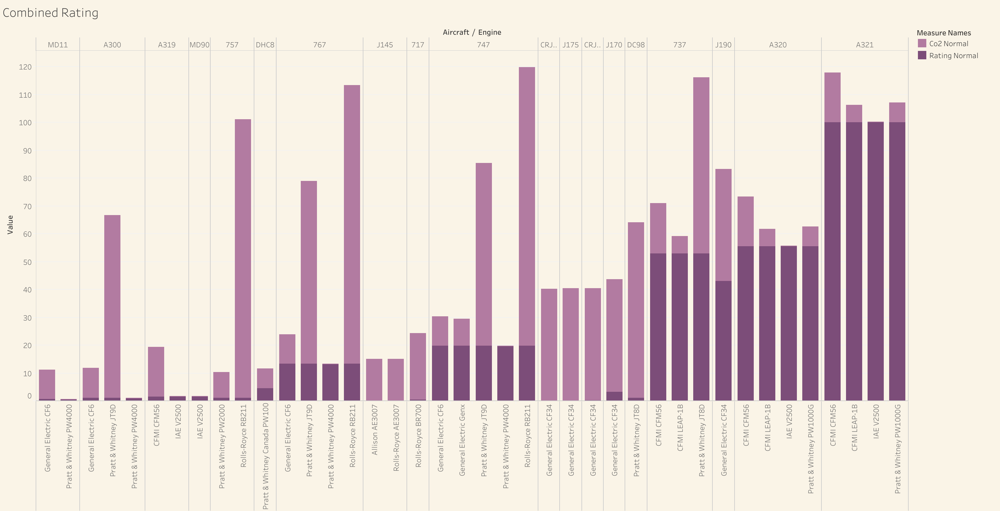
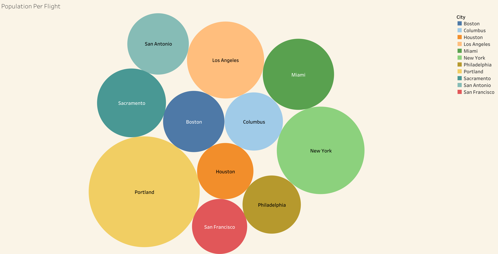

# Aircraft Risk Analysis

**Author**: Todd Strain

## Overview
Virtucon has deceided to enter into the air transportation business. The company is worried about the risk involved with aircraft operations and also, like the whole of this industry, it's environmental impact. Along the way we've asked the importanat questions of which aircraft is safest and which engine configuration has the least environmental impact. To give the company a competitive advantage we also searched for cities that are underserverd by the industry. 

Data was gathered from 4 distinct data sets to provide insights and answers to these questions. We've included the top 40 commercial aircraft operating between 2012 to 2022, the most recent years where data is avilable. Our recomendations for underseved cities are based on Census Bureau and Bureau of Transportation Statistics data.

Shown in the tables below is a summary of our findings for aircraft and engine combination and the underserved cities.

|Type  |   Narrow Body    |         Wide Body       |
|:------:| :--------------:   | :------------------------:|
| Used |   Airbus A319 / IAE V2500   | McDonell Douglas MD11 / Pratt & Whitney PW4000 |
| New  | Embraer ERJ-175 / General Electric CF34	 |      Boeing 767 / Pratt & Whitney PW4000      | 

| Underservered Metro Area |
| :----------------------: |
| Portland	ME             |
| New York	NY             |	
| Los Angeles CA           |	
| Miami	FL	               |

## Business Problem
Virtucon wants to enter the comercial aviation space. Before they do they want to understand the risks to operating in this space. Specifically they want ot understand aircraft saftey and impact on the enviornment. We've analyzed aircraft crash data, engine emissions data, and commercial flight data.

## Data
There are six sets of data used in this project, all coming form different sources.  The civil avaition accident data is from the National Trasportstion Safety Board. The domestic flight data is from the Buerau of Transportation Statistics. Data regarding Aircraft and Engines is from the Aircraft Safety Institute. Data on population comes form Wikipedia. Aircraft emmisions dat comes from th ICAO.

## Methods
Using data from 5 different datasets presents the problem of name matching. The first step in processing the data was to assign standard names for each aircraft and engine across the datasets. This was done by using a combination of string manipulation and regular expressions. We filtered the BTS aircraft list to the 40 most popular aircraft, not including propeller based aircraft, as they are less suitible to commercial operations. To determine the saftey of an aircraft we created a Injury Score based on the BTS rating. From the BTS website: “Rates are computed by dividing the number of Fatalities, Seriously injured persons, Total accidents, and Fatal accidents by the number of Aircraft-miles, Aircraft departures, or Flight hours." Our formula is 3 points for fatality; 1 point for serious injury and .5 points for minor injury all divided by the number of departures.To determine the enviornmental impact of an aircraft we merged the aircraft list from BTS with engine data from the Aircraft Safety Institute, and then with emissions data from the ICAO. The Injuty Score and Emissions metrics were then normalized so they can be presented with even weights.

To show which cities were underserverd by airlines we combined flight data from BTS, List of US Airports from Kaggle, and population data from Wikipedia. The List of US airports were loaded into a pandas dataframe and grouped by City and State. Next this grouping of airports was used to sum the total number of flights departing from that city. The Flight to Person ratio was calculated by diving the number of flights per city by it's population. 

## Results
The result show the safest aircraft is the Embreaer ERJ-145 and the Bombardier CRJ-700. These were closely followed by the Boeing 717. The combination of safest and least emissions were the (used) Airbus A319, McDonell Douglass MD11, and  (new) ERJ-175 and Boeing 767.

## Repository Structure

|---ReadMe.md -----------------------> This document  
|---Aircraft-Saftey-Analysis.ipynb --> Jupyter Notebook with data analysis  
|---Images --------------------------> Images used in this projet  
|---zippedData ----------------------> Folder with data files used for analysis  
|---presentation.pdf ----------------> PDF of presentation slides

## Interactive Viz
https://public.tableau.com/views/OriginandDestination_17387251836450/OriginandDestination?:language=en-US&publish=yes&:sid=&:redirect=auth&:display_count=n&:origin=viz_share_link

https://public.tableau.com/views/newacsa/Dashboard3?:language=en-US&publish=yes&:sid=&:redirect=auth&:display_count=n&:origin=viz_share_link

## Images
Combined Normalized Flight Saftey and Emmissions Ratings

City Population per Flight
